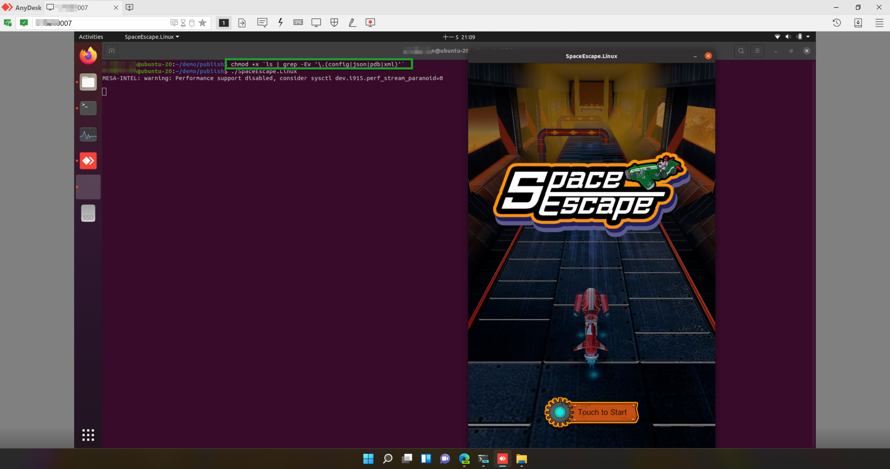

# SpaceEscape

[Stride Game Engine](https://www.stride3d.net/) (formerly Xenko)'s built-in 3D demo game project, can running on Windows using [Direct3D](https://docs.microsoft.com/en-us/windows/win32/direct3d) rendering & Ubuntu Linux using [Vulkan](https://vulkan.org/) v1.2.


## Ubuntu Linux exporting

1. Install the dependent "OpenAL", "SDL2", "FreeType", "Vulkan" packages on Ubuntu 20.04 Lts target machine: 
    - `sudo apt-get install libfreetype6-dev`
	- `sudo apt-get install libopenal-dev`
	- `sudo apt-get install libsdl2-dev`
	- `sudo apt-get install vulkan-tools mesa_vulkan-drivers` 
2. Run `dotnet publish` command inside the Linux exporting project **SpaceEscape.Linux**.
3. Copy the publish files(**Bin\Linux\Debug\linux-64\publish**) to target machine.
4. Modify the files permissions inside the publish folder in target machine:
	```
    chmod +x `ls | grep -Ev '\.(config|json|pdb|xml)'`
    ```
5. Run the game in exported project:
    ```
    ./SpaceEscape.Linux
    ```